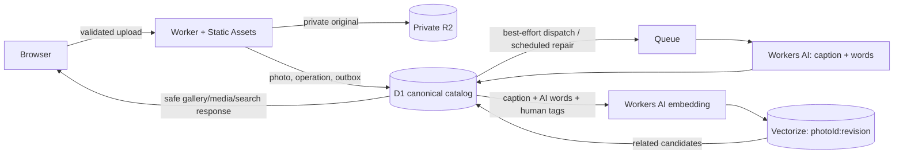

# vector-image-detection

The hosted demo is a public photo library: when an operator enables writes, anyone can upload a JPEG, PNG, or WebP and add or remove **human tags**. Private R2 holds the original; D1 is the catalog and workflow source of truth; a Queue requests Workers AI enrichment; and Vectorize holds a derived, generation-stamped text embedding.

The project also retains its offline `vis` CLI, local SigLIP experiments, and optional Qdrant adapter. Those are separate tools, not the hosted demo's implementation.

## Hosted library: important safety boundary

The production Worker is deliberately configured with public writes **off**. Enabling it makes uploads and human-tag mutations anonymous. Uploaded originals are not re-encoded, so metadata embedded in an image can remain visible to viewers of that image. There is no automatic moderation, review queue, or user-reporting flow: removal is a reactive operator purge only.

The release procedure requires explicit acknowledgements for all three facts, successful authenticated binding/readiness preflight, and a separate operator decision to turn on public writes. Never put Cloudflare tokens, account IDs, resource IDs, or preflight tokens in this repository or client code.

The deployed site also sits behind a password wall (`AUTH_PASSWORD` / `AUTH_PASS_COOKIE`) as a precondition of enabling public writes: it is what keeps a bootstrap deploy from being publicly reachable before its post-deploy readiness check has run. The authenticated `/api/v1/operator/**` endpoints (readiness, purge) are exempt from that wall — their own bearer-token check is strictly stronger, and they must stay reachable even when the wall is misconfigured so readiness can report the problem.

## Hosted architecture



- **Worker Static Assets** serves the React SPA and runs `/api/*`; R2 is not public.
- **D1** records photo state, attribution, upload operations, AI-word/model provenance, human tags, quotas, leases, outbox work, vector revisions, retention, and tombstones.
- **Queue + DLQ** make enrichment, reindexing, repair, and purge retryable. Delivery is at least once, so handlers rebuild from D1 and tolerate duplicates.
- **Workers AI** is pinned to `@cf/moondream/moondream3.1-9B-A2B` for English captions/words and `@cf/google/embeddinggemma-300m` for 768-dimensional text embeddings.
- **Vectorize** must be a 768-dimension cosine index. It stores `photoId:documentRevision`; D1 alone decides which revision is canonical, and stale generations are repair-cleaned.

AI words and human tags are different data with different ownership. AI output is normalized, bounded, and stored with its model run. Only a human-tag API can change human tags; it never edits AI words.

Search is deterministic: **exact human tag → exact AI word → related**. Related search derives a text document from the AI-generated English caption/words plus human tags — it is not raw visual or image-to-image similarity. If the embedding or Vectorize service is unavailable, exact results still return with an explicit related-results warning.

Each photo's detail page also shows a **Related photos** panel (`GET /api/v1/photos/:photoId/related`). It reuses that same caption/AI-word/human-tag document and the same Vectorize index — not a separate visual mechanism — so results are only as good as the caption: a photo captioned `"Capacitors"` with a single AI word gets thin, description-driven neighbours. Genuine image-to-image similarity exists only in the offline `pnpm vis similar` CLI (local SigLIP vectors, `Xenova/siglip-base-patch16-224`, 768-dim, local index) — a separate tool the hosted app does not use.

## State and repair model

New media is `pending`, then normally `processing` and `ready`. An enqueue or processing problem can be retryable; malformed/unrecoverable work becomes terminal `failed`; removal makes a photo `tombstoned`. Only ready, non-tombstoned photos are public.

D1 writes an outbox transactionally with the state/revision update. Scheduled repair drains unsent work, recovers expired leases, reconciles incomplete upload-operation/R2 pairs, examines DLQ/terminal diagnostics, requeues eligible work, removes stale Vectorize generations, and retries tombstone deletion across R2, vectors, and D1. Retention expiry uses the same repairable purge path.

## Local checks

```sh
pnpm install
pnpm build
pnpm typecheck
pnpm --filter @vector-image-detection/docs run check
pnpm test:scripts
pnpm --filter @vector-image-detection/demo run db:migrate:local
pnpm run cloudflare:dry-run
```

Provider fakes cover the Worker tests. A credential-free run does not simulate or prove live Workers AI, Vectorize, D1, R2, or Queue behavior.

## Provision and release later

Do not provision or deploy public writes from this README alone. Follow the ordered [Japanese operator guide](apps/docs/src/content/docs/guides/demo-and-own-photos.mdx), including least-privilege tokens, remote-only migration commands, a rendered production config, authenticated preflight, and all three acknowledgements. Docs deploy independently; demo deployment remains blocked until `cloudflare:demo-preflight` succeeds.

For the exact, ordered, copy-pasteable list of remaining human actions — provisioning, repository variables and secrets, the remote D1 migration, and turning on `DEMO_DEPLOYMENT_ENABLED` — see the [operator runbook](docs/enable-public-uploads-runbook.md). It deliberately stops short of performing any of those actions itself.

## Explicit seed collection

`apps/demo/fixtures/bundle/thumbs/` contains the repository's 100 credited thumbnails: 60 Oxford-IIIT Pet thumbnails and 40 Wikimedia Commons component thumbnails. Their attribution remains in [CREDITS.md](apps/demo/fixtures/bundle/CREDITS.md) and the fixture manifest. Only thumbnails are versioned; upstream full-resolution originals are not bundled.

The checked-in manifest command is safe to run locally and never selects remote implicitly:

```sh
node apps/demo/scripts/seed-manifest.mjs
node apps/demo/scripts/seed-manifest.mjs --remote --target production
```

`pnpm run demo:seed:local` executes the credential-free local import check: it loads all 100 credited thumbnails through the D1/R2/outbox pipeline with deterministic providers, verifies ready/attributed records, and verifies an unchanged rerun. The importer is idempotent: stable seed IDs plus checksums skip completed unchanged items and make interrupted work resumable; changed checksums replace the old item through the purge path. `knownLabel` is a test expectation only: it is never imported as an AI word or a human tag, and legacy embeddings are not imported. This command explicitly rejects `--remote --target …`; remote seeding remains a deferred authenticated operator action after resources are provisioned. Manifest validation is not a remote import or deploy action.

## Offline CLI remains available

For local, offline experiments only:

```sh
pnpm build
pnpm vis ingest ./photos --index inventory
pnpm vis search "blue connector with six pins" --index inventory
pnpm vis similar ./example.jpg --index inventory
```

`vis` uses local SigLIP vectors and can use Qdrant; its image-to-image behavior, vocabulary propagation, and optional external VLM tagging do not describe the hosted library. See [the docs site](https://doc-vector-image-detection.takazudomodular.com/docs/overview) for product, operations, and offline-tool references.
