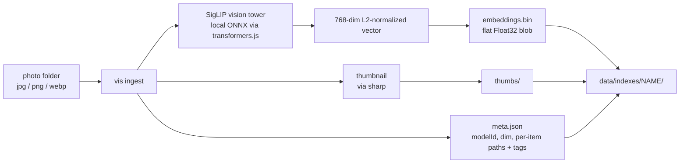
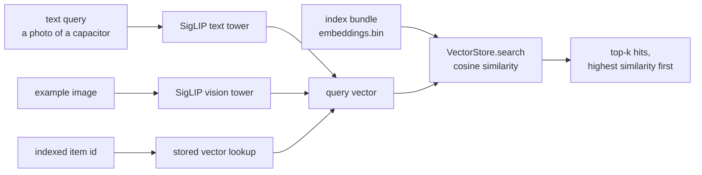
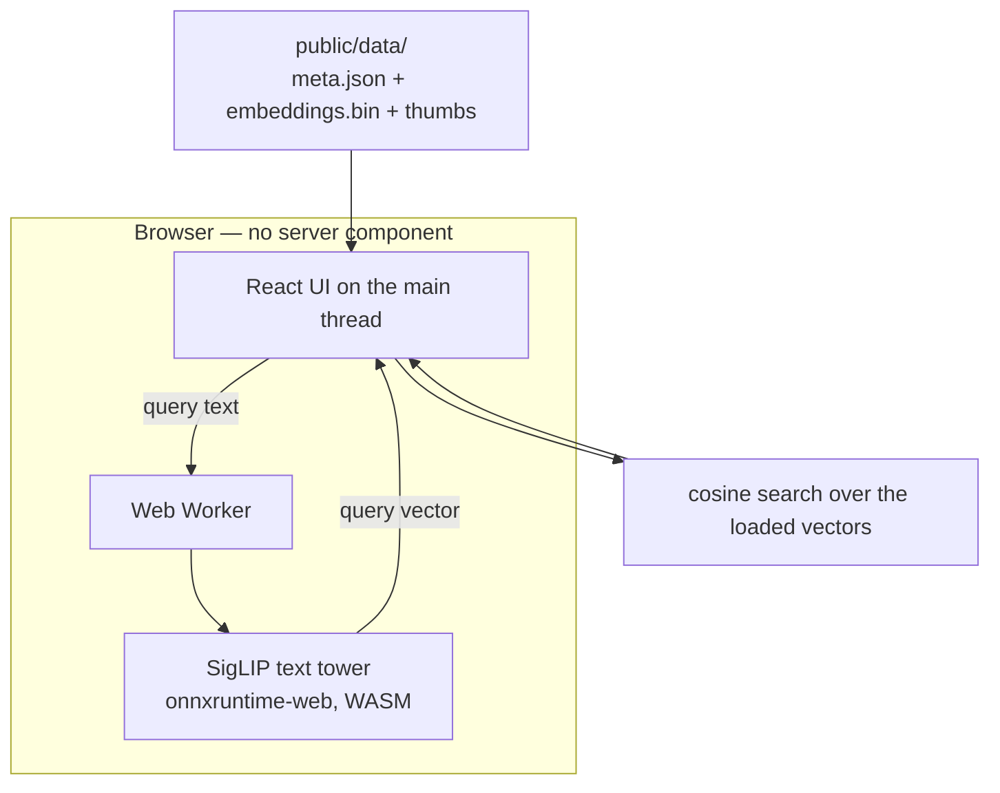

# vector-image-detection

Make a pile of unlabeled item photos findable — without labeling them first.

A customer has thousands of rough photos of things (electrical components, parts, inventory) sitting in a folder. No filenames worth reading, no tags, no captions. The usual answer is "someone has to organize this," which nobody ever does. This PoC takes the other route: a local vision model converts every photo into a 768-dimension vector that encodes what the photo _means_, and from then on you find photos by describing them ("a photo of a capacitor") or by pointing at one you already have. Nothing is labeled, nothing is filed, and search works on day one.

The architecture follows a production case study — [Search a dance movie with Vertex AI and Qdrant](https://dev.classmethod.jp/articles/search-dance-movie-with-vertexai-and-qdrant/) (Classmethod) — with every paid cloud component swapped for a free local equivalent, so the whole pipeline runs on a laptop with no API keys and no cloud budget. The swap is deliberately reversible; see [Production mapping](#production-mapping). The full research behind these choices is in [`docs/research.md`](docs/research.md).

Everything is TypeScript: [transformers.js](https://huggingface.co/docs/transformers.js) for embeddings, a `VectorStore` interface with in-memory and Qdrant implementations, a `vis` CLI, and a browser demo that runs search entirely client-side.

---

## Quickstart

Two paths. The first downloads nothing and takes about a minute; the second runs the real model on real photos.

### Path A — zero-download demo (mock mode)

```sh
pnpm install
pnpm build
pnpm demo:fixture   # copy the committed fixture bundle into apps/demo/public/data/
pnpm demo:dev       # http://localhost:5173
```

The committed fixture bundle is built by core's `FakeEmbedder` — deterministic, generated shape images, no model weights involved. The demo reads `meta.modelId`, sees `fake-embedder-v1`, and embeds your queries with the same stand-in, so every view (search, similar, auto-categorize, vocabulary tags, attach-a-word) works offline. The results are structurally real but semantically meaningless; this path exists to exercise the UI and the wiring, not to demonstrate search quality.

### Path B — real model, real photos

```sh
pnpm install
pnpm build

# ~100 license-safe sample photos into data/samples/
pnpm fetch-samples

# first ingest downloads ~200MB of model weights, then caches them
pnpm vis ingest data/samples --index all
pnpm vis ingest data/samples/pets --index pets   # cats & dogs only — the classic demo

pnpm vis search "cat" --index all
pnpm vis export-demo --index all                 # bundle -> apps/demo/public/data/
pnpm demo:dev
```

**First-run download.** `vis ingest` pulls `Xenova/siglip-base-patch16-224` (~201MB, q8-quantized) from Hugging Face on its first invocation and caches it at `~/.cache/vector-image-detection/models`, shared across every package and worktree in the repo. Subsequent runs load from disk. Once cached, ingesting 100 photos takes about 10 seconds on development-class hardware.

**Sample data.** `pnpm fetch-samples` downloads 60 cat/dog photos from the Oxford-IIIT Pet dataset and 40 electronic-component photos from Wikimedia Commons, writing `data/samples/manifest.json` and `data/samples/CREDITS.md` alongside them. It is idempotent — re-running skips files already on disk. `data/` is gitignored: no sample photo is ever committed. Use `--limit-pets N` / `--limit-components N` to fetch fewer.

To build and preview the demo as it would ship:

```sh
pnpm --filter @vector-image-detection/demo run build
pnpm --filter @vector-image-detection/demo run preview
```

### Point it at your own photos

```sh
pnpm vis ingest ~/photos/inventory --index inventory
pnpm vis search "blue connector with six pins" --index inventory -k 10
```

An index name maps to `data/indexes/<name>/`. Indexes are independent — different folders, different vocabularies, different experiments, no interference.

---

## How it works

### Ingest



An index bundle is three things on disk: `meta.json` (model identity, dimension, and one record per photo — id, file, thumb, tags, plus any license/source/author carried over from the sample manifest), `embeddings.bin` (the vectors, concatenated), and `thumbs/`. That bundle is the source of truth; every other component reads it.

`meta.json` stores `modelId` and `dim` next to the vectors because **embeddings from different models are not comparable**. Changing the embedding model is not a config tweak — it means re-indexing the entire collection.

### Query



Text and images land in the _same_ vector space — that is the whole trick. A photo of a capacitor and the phrase "a photo of a capacitor" end up near each other even though the photo has never been labeled. Search is exact brute-force cosine similarity — correct rather than approximate, and measured at about 16ms over 20,000 vectors. An approximate-nearest-neighbor index buys nothing at this scale (benchmarks in `docs/research.md` §6).

The default backend computes this in-process. `--backend qdrant` routes the same query through a Qdrant server instead, to demonstrate the production storage shape:

```sh
docker run -p 6333:6333 -p 6334:6334 -v "$(pwd)/qdrant_storage:/qdrant/storage:z" qdrant/qdrant
pnpm vis qdrant sync --index all
pnpm vis search "cat" --index all --backend qdrant
```

Both backends returned byte-identical top-5 results in end-to-end verification ([`docs/e2e-confirm-report.md`](docs/e2e-confirm-report.md), item 10). The index bundle stays the source of truth either way; `qdrant sync` overwrites the collection from it.

### Demo: the text tower in a Web Worker



The demo ships precomputed image vectors, so the browser only ever needs the **text** tower — transformers.js v4 exposes SigLIP's two towers separately, which is what makes this possible. That tower is about 100MB, and it is lazy: nothing is fetched until you first search, categorize, score vocabulary, or click "load it now" in the status bar. Gallery browsing costs zero model bytes. Inference runs in a Web Worker so a query never freezes the UI, and the onnxruntime WASM binaries are self-hosted from the app's own bundle — no third-party CDN is contacted at runtime.

Full demo notes, including tag persistence and the mock-mode rule, are in [`apps/demo/README.md`](apps/demo/README.md).

---

## The three mechanisms

"AI photo search" gets used as one idea. It is three, and they solve different problems at different costs. Keeping them separate is the point of this PoC.

### 1. Search without words

The photos need no words at all. Because image and text share a vector space, two search modes work with zero labeling effort:

```sh
pnpm vis search "cat" --index all -k 5
pnpm vis similar cat-abyssinian-1.jpg --index pets
pnpm vis similar ./some/external/photo.jpg --index pets   # an unindexed image works too
```

This alone answers a large share of "find my photo." In verification, `search "cat"` and `search "dog"` each returned 5/5 correct in the top 5, and `similar` on a cat returned 5/5 cats at similarity 0.75–0.84.

### 2. Word amplification — spreading words humans already chose

The words come from people; the system spreads them. Two mechanisms, both human-in-the-loop:

**Zero-shot tagging against your vocabulary.** You supply the candidate words; every photo is scored against `"a photo of a {word}"` and words scoring at or above a threshold are proposed.

```sh
pnpm vis tag vocab capacitor resistor connector --index all --threshold 0.05
pnpm vis tag vocab cat dog --index pets --threshold 0.05 --apply   # persist accepted proposals
```

**Exemplar propagation.** You tag one photo by hand; the system proposes that tag on its nearest neighbors, which you confirm or reject one at a time. This is what the demo calls "attach a word," and it turns "label 10,000 photos" into "label a few and confirm suggestions."

```sh
pnpm vis tag propagate cat-abyssinian-1.jpg fluffy --index pets
```

**Scores are similarities, and the threshold is a knob — expect to tune it.** The scores `tag vocab` prints are raw cosine similarities between an image vector and a vocabulary vector, not calibrated confidence. A score of 0.06 does not mean "6% sure"; it means "closer to this word than to a score of 0.04." Their absolute range depends on the model and the vocabulary. On this SigLIP model with the cat/dog vocabulary, observed scores spanned −0.005 to 0.092, so the CLI's default `--threshold 0.2` proposes nothing at all and roughly **0.03–0.08 is the useful band** — start there, look at what it proposes, and adjust. `--threshold 0.05` gave cat 30/30 and dog 28/30 on the sample pets index. Lowering the default is tracked in [issue #18](https://github.com/Takazudo/vector-image-detection/issues/18); until then, treat the default as a placeholder rather than a recommendation. The demo's percentage bars use a softmax over these same similarities purely as a display transform — they are relative shares within one vocabulary, never probabilities.

### 3. True auto-word generation — the VLM path (optional, paid)

Mechanisms 1 and 2 never invent a word. This one does: a vision-language model looks at a photo and writes tags and a caption from scratch, in the language you ask for. It is the only mechanism here that can read text printed on an object and turn it into a tag.

```sh
pnpm vis tag vlm components/capacitor-1.jpg --index all --language ja --confirm-upload
```

- **Privacy — photos leave your machine.** Every image passed to this command is uploaded to Anthropic's API and is subject to that service's data handling, not this repo's. This is the only part of the system that is not fully local. `--confirm-upload` is mandatory precisely so this can never happen by accident.
- **Cost.** Claude Haiku 4.5 (the default) runs roughly **$0.002–0.004 per image** — on the order of **$2–10 for 1,000 photos**. A real batch run should use the [Message Batches API](https://platform.claude.com/docs/en/build-with-claude/batch-processing) for about half that. Ballparks, not quotes.
- **Setup.** Requires `ANTHROPIC_API_KEY` in the environment.
- **Resolution — read this before judging OCR quality.** `vis tag vlm` uploads the index's **256px thumbnail**, not the original photo: the index bundle does not retain the source directory, and a smaller upload is a privacy and cost win (`packages/cli/src/commands/tag-vlm.ts`). The tagger library caps images at a ≤1024px long edge, but the CLI never reaches that cap. So expect solid object-level tags and captions from this command, and do **not** expect small printed part numbers to survive 256px. Reading fine markings needs the original resolution — call `vlmTag` directly with the source paths.
- **What gets kept.** Only the tags you confirm are written back into `meta.json`. The caption is printed and then discarded, and the tagger's `readableText` field is not surfaced by the CLI at all — re-running to recover either one costs the API call again.
- **Why it matters.** It is the quality ceiling for fine-grained domains, and it sidesteps the Japanese-language problem entirely — `--language ja` gets Japanese tags written directly rather than translated.

Details and the cost table live in [`packages/vlm-tagger/README.md`](packages/vlm-tagger/README.md).

---

## Auto-categorize: what to expect

The demo's auto-categorize view offers two modes that look similar and behave very differently.

**Group by your words (`classifyByVocab`) — reliable.** You give it a small vocabulary; each photo is assigned to its single best-matching word. Because it picks a winner _relative to the other candidates_ rather than testing against an absolute threshold, it holds up well. On the sample pets index it scored **100% (60/60)** separating cats from dogs, using the plain `"a photo of a {}"` template and no tuning. This is the mode to demonstrate and the mode to build on.

**Discover groups (k-means) — exploratory.** No vocabulary; spherical k-means clusters the vectors and you look at what fell together. It found a clean 2-way cat/dog split (100% pure) on the sample data, but clusters carry no names and nothing guarantees they align with any category you care about. Use it to ask "what's in this pile?", not to produce labels.

```sh
pnpm vis cluster --k 2 --index pets
pnpm vis cluster --auto --index all      # pick k via silhouette score
```

**The honest ceiling.** Zero-shot classification is strong on coarse everyday categories and degrades on fine-grained niche domains — which is exactly the electrical-components case this PoC targets. Published measurements put mean zero-shot accuracy near 36% on domain-specific label sets, and PCB-component classification needed few-shot fine-tuning to get good. Cat-vs-dog at 100% is a real result and also an easy one. Distinguishing two capacitor models by part number is not something mechanisms 1 and 2 will do for you; that needs the VLM path at full resolution (not `vis tag vlm`'s 256px thumbnails) or a small amount of fine-tuning. See `docs/research.md` §4.2.

---

## CLI reference

Run from the repo root after `pnpm build`. Every command takes `--index <name>` (default: `default`), resolving to `data/indexes/<name>/`.

| Command                        | What it does                                                                                      |
| ------------------------------ | ------------------------------------------------------------------------------------------------- |
| `vis ingest <dir>`             | Walk `<dir>` for jpg/png/webp, embed each image, write the index bundle                           |
| `vis search <text>`            | Embed the text, print the top-k nearest images (`-k`, `--backend memory\|qdrant`, `--qdrant-url`) |
| `vis similar <idOrPath>`       | Nearest neighbors of an indexed item id or an external image path (`-k`)                          |
| `vis cluster`                  | Spherical k-means grouping (`--k <n>`, `--auto`, `--json`)                                        |
| `vis tag vocab <words...>`     | Zero-shot proposals over the whole index (`--threshold`, `--apply`)                               |
| `vis tag propagate <id> <tag>` | Propose a tag from one exemplar onto its neighbors (`--threshold`, default 0.75; `--yes`)         |
| `vis tag vlm <ids...>`         | Claude-API tagging — uploads images (`--language en\|ja`, `--confirm-upload` required)            |
| `vis qdrant sync`              | Push the index into a Qdrant collection, `vis-<index>` (`--url`)                                  |
| `vis export-demo`              | Copy the bundle plus thumbs into `apps/demo/public/data/`                                         |

`pnpm vis <command> --help` prints the authoritative options for any command.

---

## Production mapping

Nothing here is a dead end. The pipeline is **embed → store vectors and payload → cosine search** at every scale; this PoC swaps in free local parts, and moving to production means swapping them back rather than redesigning.

| Stage          | This PoC (local, free)                                                   | Production shape                                                                                                                  |
| -------------- | ------------------------------------------------------------------------ | --------------------------------------------------------------------------------------------------------------------------------- |
| Embedding      | `Xenova/siglip-base-patch16-224` via transformers.js, on-device          | Vertex AI `multimodalembedding` (the reference article's choice), or self-hosted SigLIP2 on GPU for lower per-call cost at volume |
| Vector storage | `VectorStore` interface — in-memory by default, Qdrant adapter available | Qdrant or pgvector, with metadata filtering alongside vector search                                                               |
| Photo source   | Local folder walk (`vis ingest`)                                         | Event-driven ingestion from cloud storage upload events (e.g. GCS object-finalize)                                                |
| Search         | Exact brute-force cosine, in-process                                     | Same cosine semantics, served by the database                                                                                     |
| Tagging        | Zero-shot vocabulary + exemplar propagation, local                       | Same, plus VLM-assisted tagging or few-shot fine-tuning for labels zero-shot cannot reach                                         |

**When to move.** Exact search stays fast and correct into the tens of thousands of images (16ms at 20,000 vectors); plan for an ANN-backed index somewhere past **roughly 100,000**. Move earlier than that if you need multi-user concurrency, metadata-filtered queries at scale, or ingestion that keeps up with uploads without a batch run. Because `VectorStore` is an interface and the embedder is model-agnostic beyond dimension bookkeeping, both swaps are implementation changes, not rewrites — the one migration with a real cost is changing the embedding model, which forces a full re-index.

Full analysis, benchmarks, model comparison, Japanese-language options, and prior art: [`docs/research.md`](docs/research.md).

---

## Repo layout

```
packages/core/         embedding, VectorStore (in-memory + Qdrant), clustering, labeling
packages/cli/          the vis CLI (commander)
packages/vlm-tagger/   optional Claude-API tagging — Node-only, isolated from core and demo
apps/demo/             React + Vite browser demo, no server component
scripts/               fetch-samples.mjs and helpers
docs/                  research.md, e2e-confirm-report.md, customer-explainer.ja.md
data/                  gitignored — samples/ and indexes/ are generated locally
```

`packages/vlm-tagger` is deliberately walled off: `packages/core` and `apps/demo` never import it, so `@anthropic-ai/sdk` and Node-only image handling can never reach browser code.

## Development

```sh
pnpm install
pnpm typecheck
pnpm test          # vitest + node:test scripts
pnpm build
pnpm format
```

Requires Node ≥ 22.12 and pnpm 10. Tests that need real model weights are gated behind `RUN_MODEL_TESTS=1`; the live VLM test needs `RUN_VLM_LIVE=1` plus an API key. Everything else runs offline.

End-to-end verification against the real model on real sample data is recorded in [`docs/e2e-confirm-report.md`](docs/e2e-confirm-report.md).

## For non-technical readers

[`docs/customer-explainer.ja.md`](docs/customer-explainer.ja.md) explains the same system in Japanese, without jargon — what it can do, what it cannot, and what it costs.

---

## Licenses

**This repository's code** is MIT licensed — see [`LICENSE`](LICENSE).

Everything else it touches carries its own terms:

| Component                              | License                                           | Notes                                                                                                                                                                |
| -------------------------------------- | ------------------------------------------------- | -------------------------------------------------------------------------------------------------------------------------------------------------------------------- |
| `Xenova/siglip-base-patch16-224`       | Apache-2.0                                        | Downloaded at runtime, never vendored. Chosen partly _because_ the license is clean — see `docs/research.md` §3 for the models that were rejected on license grounds |
| Oxford-IIIT Pet sample photos          | CC BY-SA 4.0                                      | Downloaded by `pnpm fetch-samples` at runtime; `data/` is gitignored, so no photo is committed                                                                       |
| Wikimedia Commons sample photos        | Per-file (CC0 / public domain / CC BY / CC BY-SA) | Filtered against a license allowlist at fetch time; each file's license, source, and author are recorded in `data/samples/CREDITS.md` and carried into `meta.json`   |
| Demo fixture images                    | Generated                                         | Programmatically drawn shapes — no third-party imagery                                                                                                               |
| `packages/core/fixtures/{cat,dog}.jpg` | CC0 1.0                                           | The only photos in the repository; provenance verified on each source page and recorded in `packages/core/fixtures/CREDITS.md`                                       |

Sample photos are for evaluating this PoC. If you redistribute anything built on the CC BY-SA 4.0 set, the share-alike terms follow it.
