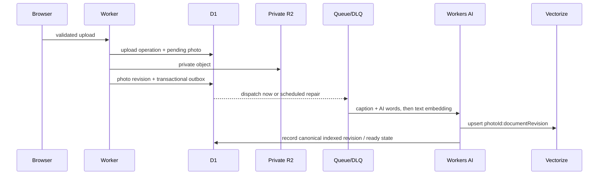

# @vector-image-detection/demo

This app is a Cloudflare Worker Static Assets deployment: the Worker serves the React SPA and handles `/api/*`. It is a public photo library only after an operator completes the production checklist and explicitly turns public writes on. It is intentionally read-only by default.

## Product boundary

When writes are enabled, uploads and human-tag edits are anonymous. The Worker accepts JPEG, PNG, and WebP only, validates signature/header dimensions, limits each file to 5 MiB, applies same-origin and `Sec-Fetch-Site` checks, rate limits, and D1 daily/global quotas. These are abuse controls, not identity or content moderation.

Originals stay in private R2 and are served through the Worker only when the photo is ready. They are not re-encoded; image metadata may remain exposed. There is no automated moderation, review queue, or reporting workflow. Operators can emergency-disable writes and issue a reactive purge, which safely retries until R2 objects, every Vectorize generation, and D1 records are removed.

The purge entry point is operator-only; there is no public or browser admin control. Set `DEMO_PURGE_URL`, secret `DEMO_PURGE_TOKEN` (the deployed `OPERATOR_PREFLIGHT_TOKEN`), `DEMO_PURGE_PHOTO_ID`, and a non-empty `DEMO_PURGE_REASON`, then run `pnpm run cloudflare:demo-purge`. The command requires HTTPS and returns only after the durable tombstone/outbox operation is accepted; Queue repair completes deletion and retains terminal tombstone diagnostics.

## Data flow and search



D1 is canonical. Queue delivery is at least once, so the outbox, handlers, leases, and repair jobs make duplicates and interrupted work safe. Photos progress through `pending`, `enqueue_failed`, `processing`, `ready`, retryable/terminal failure, and `tombstoned`; only ready, non-tombstoned media is readable.

Workers AI uses pinned `@cf/moondream/moondream3.1-9B-A2B` and `@cf/google/embeddinggemma-300m`. AI English caption/words are a model-owned, separately stored provenance stream. Human tags are separately stored and can be attached/removed by the public tag API; that API cannot alter AI words.

Search has fixed priority: **exact human tag**, then **exact AI word**, then **related**. Related means a semantic search over a text document made from AI-generated English caption/words plus human tags. It is not visual similarity or image-to-image search. Vectorize uses 768-dimensional cosine vectors and revision-stamped IDs (`photoId:documentRevision`); results are hydrated and filtered through D1 so stale/noncanonical generations cannot be returned. A Workers AI/Vectorize problem leaves exact matches usable and reports related-search degradation.

## Local development and checks

```sh
pnpm install
pnpm --filter @vector-image-detection/demo run db:migrate:local
pnpm --filter @vector-image-detection/demo run dev

pnpm --filter @vector-image-detection/demo run test:worker
pnpm --filter @vector-image-detection/demo run test:dom
pnpm --filter @vector-image-detection/demo run test:output
pnpm --filter @vector-image-detection/demo run typecheck
pnpm --filter @vector-image-detection/demo run build
pnpm --filter @vector-image-detection/demo run deploy:dry-run
pnpm --filter @vector-image-detection/demo run deploy:dry-run:production
```

`wrangler dev` uses the local configuration and fake/test providers where applicable. It does not prove compatibility with live Workers AI or Vectorize. The local `ai.remote` binding requires Cloudflare access if code actually invokes it; tests must use provider fakes.

## Later production provisioning and release

The checked-in production config contains inert placeholders and `PUBLIC_WRITES_ENABLED: "false"`. Never edit it with a real account ID or resource name. Use CI/release environment variables to render `.wrangler.production.generated.json` only after an operator has provisioned the resources named in the [operator guide](../docs/src/content/docs/guides/demo-and-own-photos.mdx).

The deploy workflow has two independent jobs:

1. Docs build, dry-run, and deploy without the demo readiness gate.
2. Demo render, dry-run, authenticated `GET /api/v1/operator/readiness` preflight, deploy, then a second strict readiness gate against what was just deployed—but only after an operator explicitly sets the repository variable `DEMO_DEPLOYMENT_ENABLED=true`. Leave it unset while account provisioning is deferred; the demo job will be skipped without turning the docs workflow red.

The demo job renders `.wrangler.production.generated.json` once and both dry-runs and deploys that same file, so a green dry-run covers the real resource substitutions rather than the inert template.

### The two readiness gates

The pre-deploy gate interrogates the _already deployed_ Worker, which does not exist before the first-ever deploy. It is therefore bootstrap-tolerant: a target that does not resolve, refuses the connection, or answers a Cloudflare 1000-series edge error downgrades to a `::warning::` and the job continues. A target that answers—including a `401`, or a `200` reporting a failed check—still fails the job exactly as before, so nothing changes once the demo is live.

On a bootstrap run this means traffic switches before verification. The password wall is the compensating control (nothing is publicly reachable even if the deploy is wrong) and `DEMO_DEPLOYMENT_ENABLED` remains the outer human opt-in. The post-deploy gate is strict, mandatory, and prints the `wrangler rollback` command when it fails.

### Deployment secrets

Secrets are uploaded with the version itself via `wrangler deploy --secrets-file`, not through `wrangler secret put`, which cannot create a Worker that does not exist yet and would otherwise leave a window where the Worker serves ungated. CI stages the file under `RUNNER_TEMP` at mode 600 and removes it in an `always()` step.

| Repository secret      | Deployed name              | Purpose                                                         |
| ---------------------- | -------------------------- | --------------------------------------------------------------- |
| `AUTH_PASSWORD`        | `AUTH_PASSWORD`            | Password wall; a production Worker without it refuses to serve. |
| `AUTH_PASS_COOKIE`     | `AUTH_PASS_COOKIE`         | Fixed cookie value that lets CI and agents skip the prompt.     |
| `DEMO_PREFLIGHT_TOKEN` | `OPERATOR_PREFLIGHT_TOKEN` | Bearer token for the operator readiness and purge endpoints.    |

The two gate secrets deliberately keep their un-prefixed names: they already exist on the repository under exactly those names and are also the keys used in the local `.env`, so one name covers CI, the deployed Worker, and local dev.

`pnpm run cloudflare:demo-preflight` requires `DEMO_PREFLIGHT_URL`, `DEMO_PREFLIGHT_TOKEN`, and exact values for all three acknowledgements:

```sh
ACK_ANONYMOUS_PUBLIC_WRITES=I_ACKNOWLEDGE_ANONYMOUS_PUBLIC_WRITES
ACK_RETAINED_IMAGE_METADATA=I_ACKNOWLEDGE_RETAINED_IMAGE_METADATA
ACK_REACTIVE_PURGE_ONLY=I_ACKNOWLEDGE_REACTIVE_PURGE_ONLY_MODERATION
```

The readiness endpoint must confirm production configuration, D1/migrations, private R2, Queue/DLQ, Workers AI binding, a 768-dimensional cosine Vectorize index, rate limiting, pinned models, public writes, and acknowledgements. It performs binding/configuration checks without a billable AI inference. Live end-to-end provider smoke tests remain deferred until resources exist.

## Seed collection

The 100 credited seed thumbnails under `fixtures/bundle/thumbs/` are the only repository media seed collection. [CREDITS.md](fixtures/bundle/CREDITS.md) and `manifest.json` retain the source, author, and licensing material. Only thumbnails are versioned; no full-resolution upstream originals are bundled.

```sh
# validates local 100-entry manifest; it does not write Cloudflare resources
node apps/demo/scripts/seed-manifest.mjs

# remote selection is explicit; this still validates the manifest only
node apps/demo/scripts/seed-manifest.mjs --remote --target production

# executes the credential-free local D1/R2/outbox seed import and unchanged-rerun check
pnpm run demo:seed:local
```

The internal importer uses the same validation, D1 upload-operation, private R2, and outbox path as uploads. `demo:seed:local` runs it against deterministic local Worker resources, verifies all 100 records become ready with attribution, and checks an unchanged rerun. Stable seed IDs/checksums make reruns idempotent, resume interrupted work, and replace changed content safely. It copies attribution but never imports `knownLabel` as an AI word or human tag, nor legacy embeddings. The command deliberately rejects remote targets: remote seeding remains a deferred authenticated operator action after provisioning. Do not describe manifest validation as seeding or remote import.
