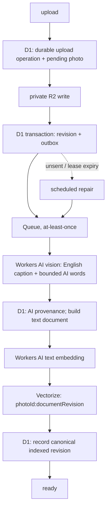

## 処理経路

R2 成功後に outbox を作る D1 transaction が失敗しても、先に durable upload operation があるため orphan を追跡・修復できます。Queue の send-before-mark 重複、期限切れ lease、DLQ、失敗した即時 cleanup は想定内です。repair は outbox drain、操作/R2 reconciliation、retryable job、stale generation、retention/tombstone purge を再実行します。

## revision と index

caption/AI words/human tags の変更は document revision を進めます。`photoId:documentRevision` を新しく upsert し、同じ revision のときだけ D1 が canonical indexed revision を進めます。検索結果は必ず D1 で ready、非 tombstone、canonical generation を検査します。Vectorize metadata は catalog の正本ではありません。

## 検索の意味

human exact → AI exact → related の順で、写真 ID は強い理由だけ残して重複排除します。related の埋め込み文書は英語 caption、AI words、human tags から作るため、raw visual similarity でも image-to-image search でもありません。サービス障害時は exact tier を返し、related warning を返します。

写真ごとの **Related photos** パネル（`GET /api/v1/photos/:photoId/related`）は related tier と同じテキスト文書・同じ Vectorize index を再利用する、cursor 付きの別 endpoint です。この endpoint は embedding 推論を実行せず既存 vector を ID で引くだけなので、`degradedReason` は二種類だけです。`:photoId` にまだ canonical vector がない `vector_pending`（enrichment 直後の一時的な状態 — Vectorize は eventually consistent）と、既存 vector の参照自体が失敗した `provider_unavailable` です。結果の質は related tier と同じく caption の質が上限です。
